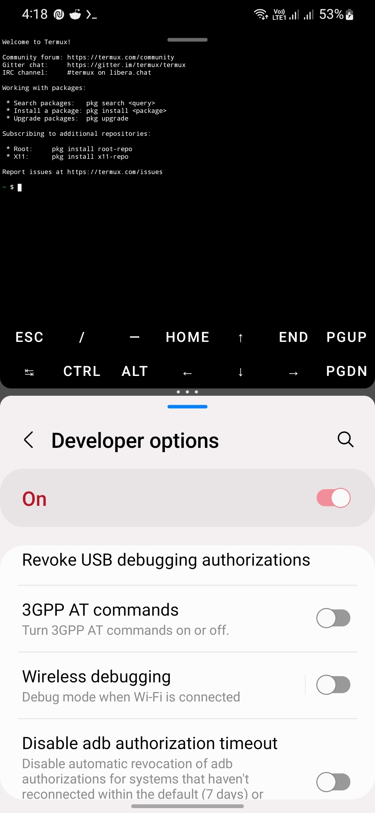
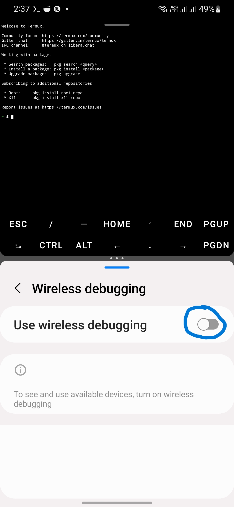
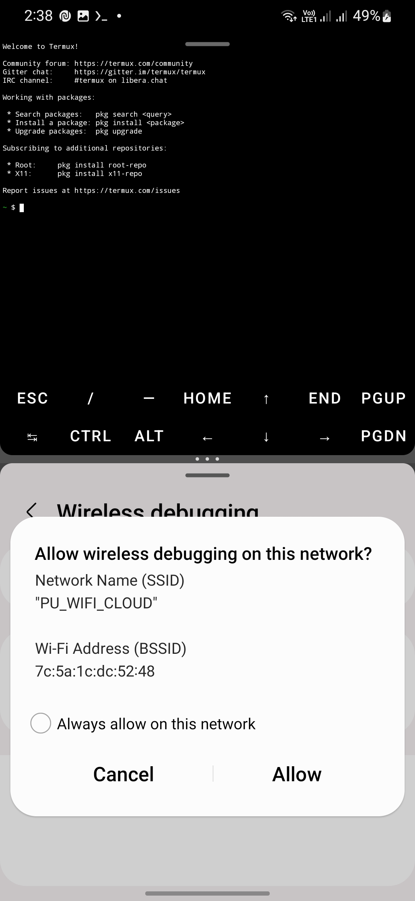
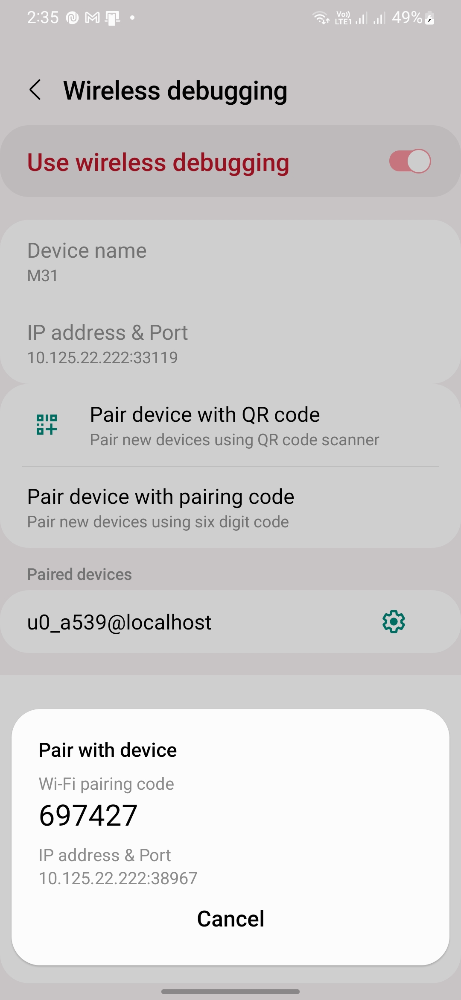
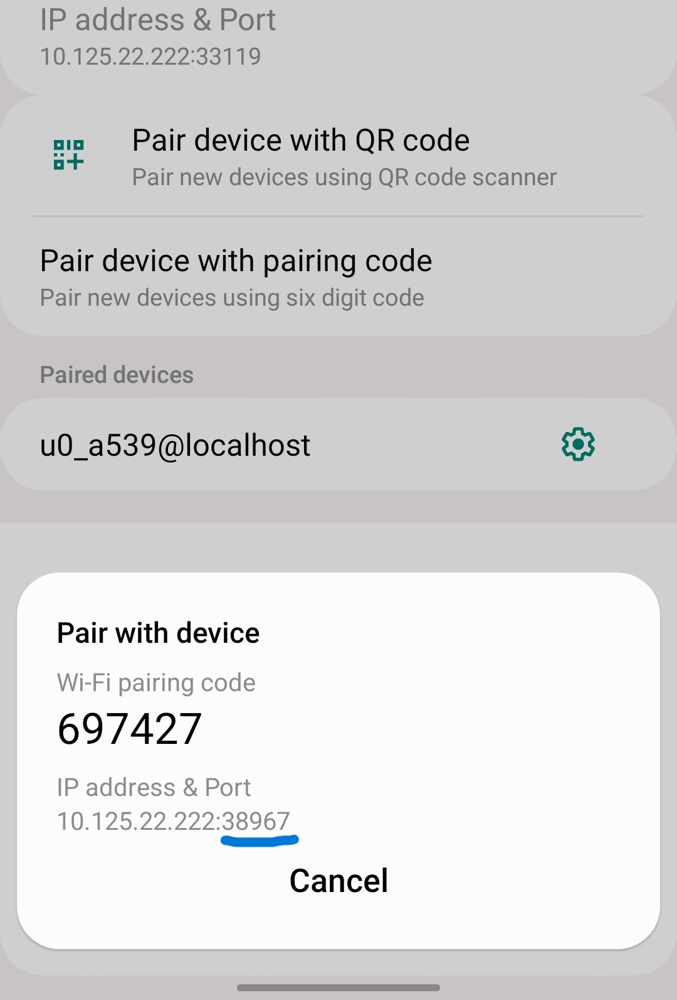
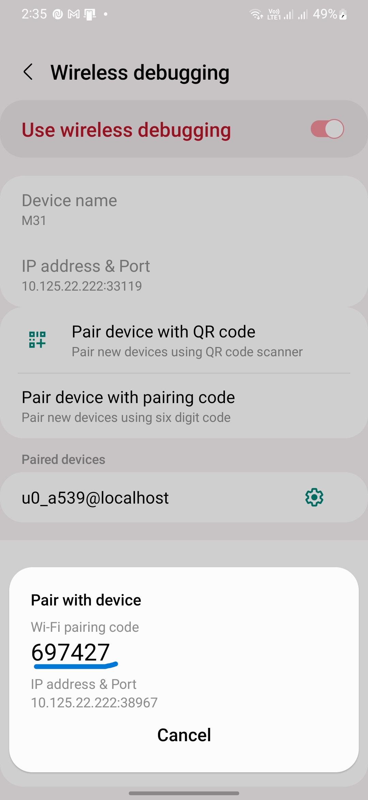
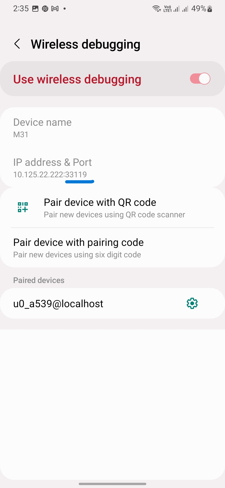

# Instructions
#### Step 1.
Open termux and settings -> Developer Options -> Wireless Debugging in split screen like this

#### Step 2.
Connect to a local wifi network and turn on **use wireless debugging** button and press allow button



#### Step 3.
scroll down a bit you'll find option **Pair Device with pairing code** click it and a dialog opens with a 6 digit ping and ip address:port to connect



#### Step 4
In termux use this command to clone and install dependencies
```bash
apt update
apt upgrade -y
apt install git -y
git clone https://github.com/SaicharanKandukuri/termux-android12-phantom-fix
cd termux-android12-phantom-fix
bash runme.sh
```
#### Step 5
for prompt like this below
```console
Enter Auth port ( Port show in option enter six digit number): 
```
enter the port number shown in dialog

#### Step 6
for promt like this below
```console
Enter Auth pincode: 
```
enter the six digit number ( pairing code )

#### Step 7
for promt like this below
```console
Enter debug port: 
```
Enter the port number which appears at ( check below image )


<hr>
After this script takes care of remaining part

> Every Time you login to termux it 
